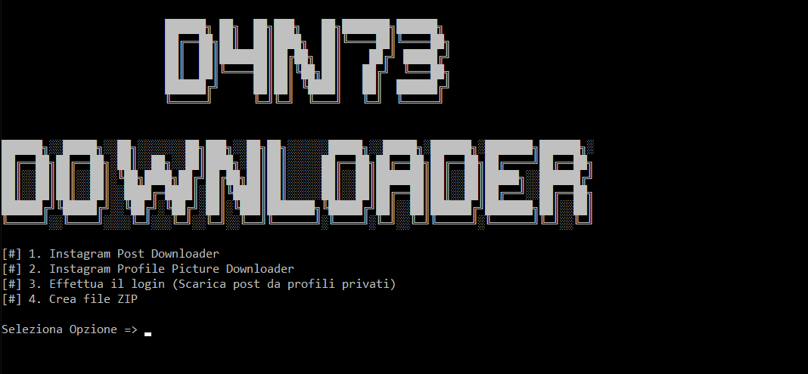
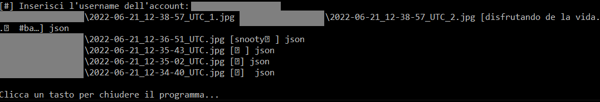
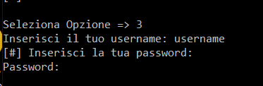
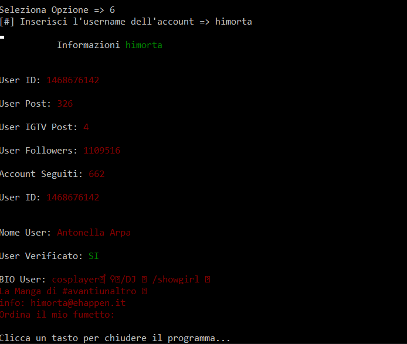
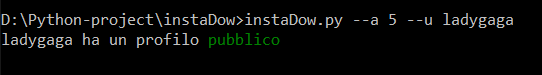
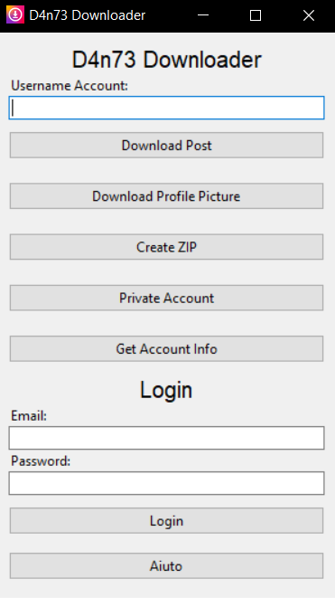
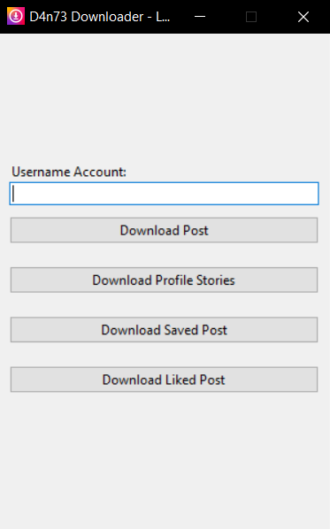
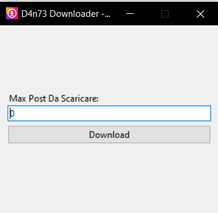

# instaDownloader
Instagram posts, stories, saved/liked posts and profile picture downloader in python

## Features
- Bulk post downloaer
- Single post downloader (from url) 
- Profile picture download
- Download post from private accounts (require login)
- Download stories (require login)
- Create zip archive with downloaded post
- Check if the profile is public or private
- Download saved post (require login)
- Download liked post (require login)
- Command line usage

## Usage
Execute the instaDow.py file and select the option:

`1. -- Download post from pubblic profile`

`2. -- Donload profile picture`

`3. -- Login and download post from private profile`

`4. -- Create an archive from downloaded directory`

`5. -- Check profile`

`6. -- Get profile info from username`

`7. -- Download single post from url`

## Usage (Command Line)
 `instaDow.py --azione 5 --username ladygaga` or `instaDow.py --a 5 --u ladygaga`
 
 This performs **step 5** (Check profile) on the username **ladygaga**

## Requirements
- instaloader
```
pip insall instaloader
```
- argparse
```
pip insall argparse 
```

For Gui Version:
- tkinter
```
pip insall tk
```

## Prewiew










---






