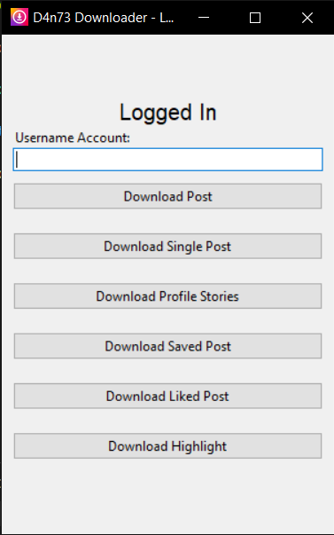
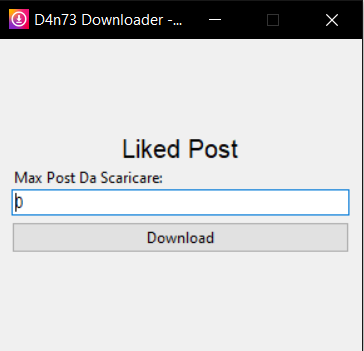

# instaDownloader

<p align=center>
 
 
</p>

Instagram posts, stories, highlight, saved/liked posts and profile picture downloader in python

## Features
- Bulk post downloader
- Single post downloader from url (requires login)
- Profile picture download
- Download post from private accounts (requires login)
- Download stories (requires login)
- Create zip archive with downloaded post
- Check if the profile is public or private
- Download saved post (requires login)
- Download liked post (requires login)
- Download highlight (requires login)
- 2FA login
- Command line usage
- Automatic conversion from URL to username

## Usage
Execute the instaDow.py file and select the option:

`1. -- Download post from public profile`

`2. -- Download profile picture`

`3. -- Login and download post from private profile`

`4. -- Create an archive from downloaded directory`

`5. -- Check profile`

`6. -- Get profile info from username`

### Login 
With logged account you can acces these options:

`1. -- Download post from private profile`

`2. -- Download stories`

`3. -- Download saved posts`

`4. -- Download liked post`

`5. -- Download single post`

`6. -- Download highlight stories`


## Usage (Command Line)
 `instaDow.py --azione 5 --username ladygaga` or `instaDow.py --a 5 --u ladygaga`
 
 This performs **step 5** (Check profile) on the username **ladygaga**

## Requirements
- instaloader
```
pip install instaloader
```
- argparse
```
pip install argparse 
```

For Gui Version:
- tkinter
```
pip install tk
```

## Preview


---

<p align="center">GUI Version</p>







