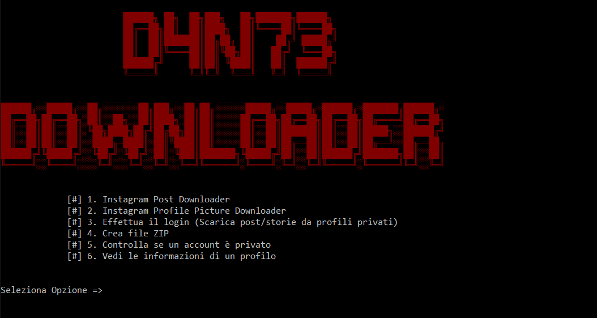

# instaDownloader
Instagram posts and profile picture downloader in python

## Features
- Bulk post downloaer
- Profile picture download
- Login for download post from private accounts
- Download stories (require login)
- Create zip archive with downloaded post
- Check if the profile is public or private

## Usage
Execute the instaDow.py file and select the option:

`1. -- Download post from pubblic profile`

`2. -- Donload profile picture`

`3. -- Login and download post from private profile`

`4. -- Create an archive from downloaded directory`

`5. -- Check profile`

`6. -- Get profile info from username`

## Requirements
- instaloader
```
pip insall instaloader
```

## Prewiew



